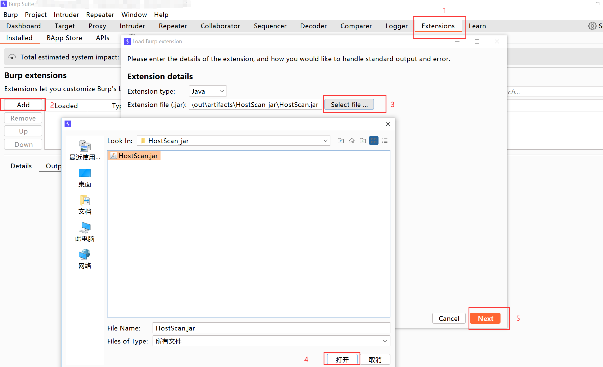
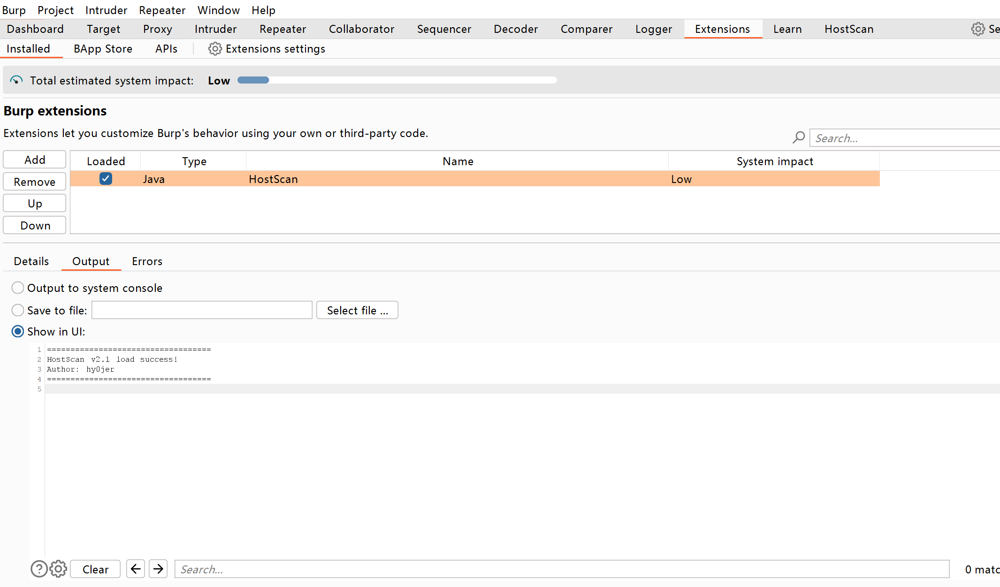
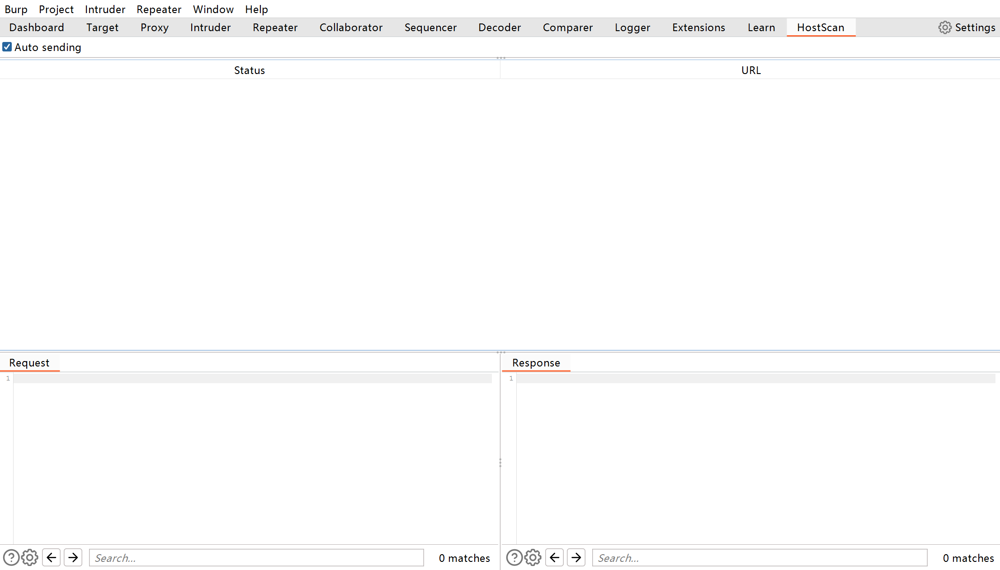
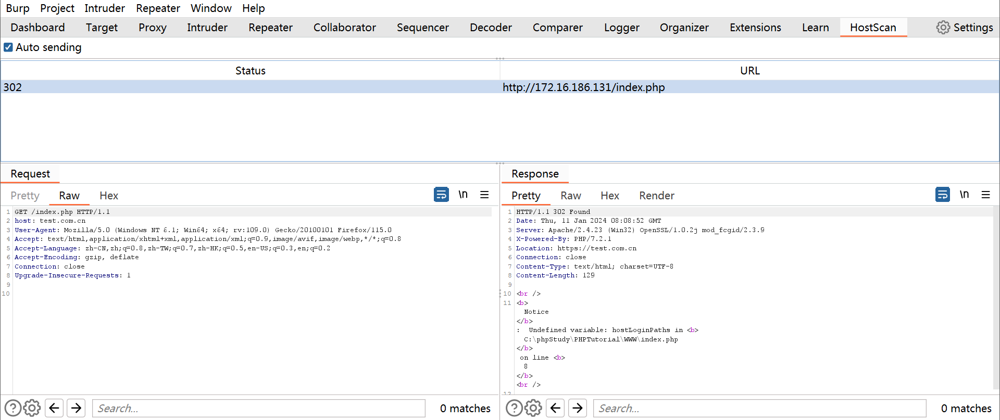
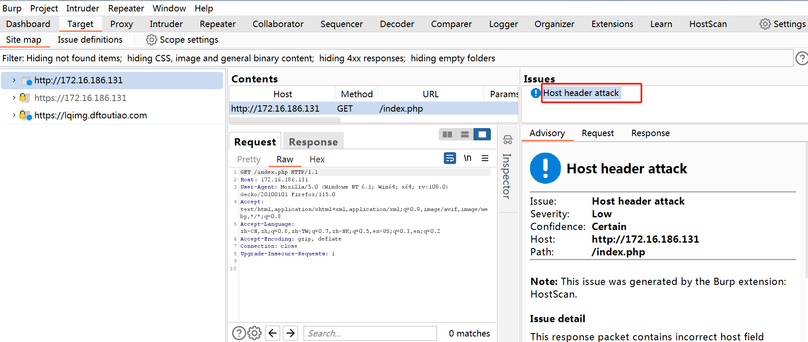
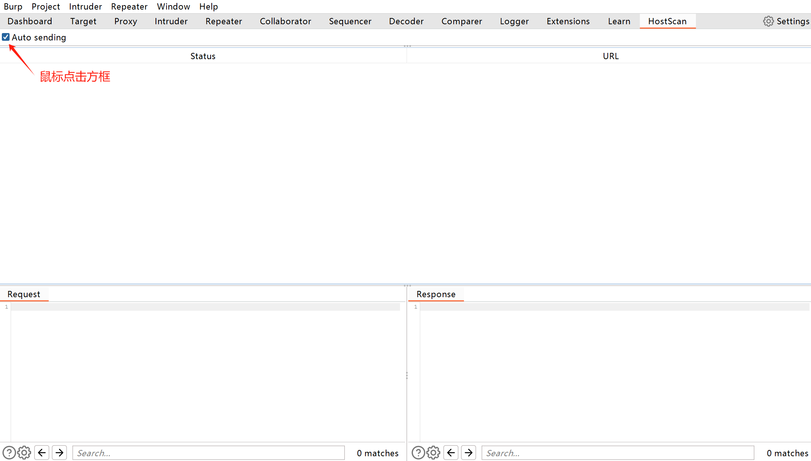
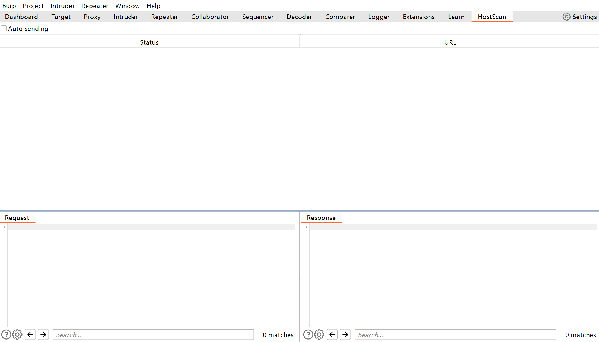
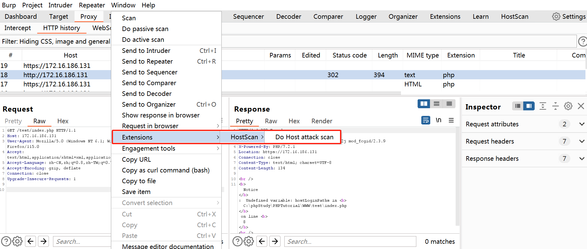
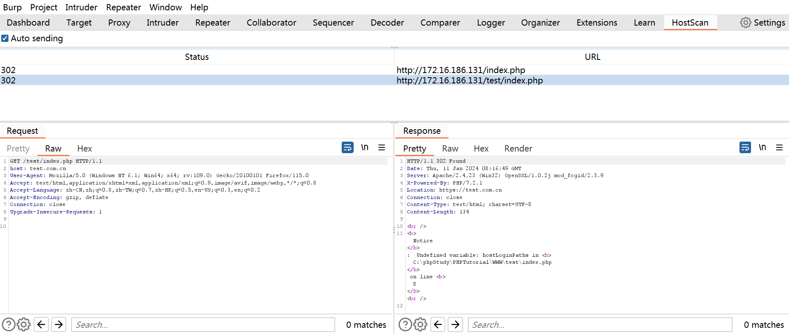

## 前言

该BP插件是在工作之余编写出来的，设计初衷是实现对host头攻击的全自动检测，这是作者第一次尝试编写bp插件，可以说是个Demo项目，如果有任何使用问题或者其他好的idea，可提交issues 

## 简介

该插件支持对host头攻击的全自动检测和主动扫描

#注意该BP插件使用MontoyaApi编写，不兼容旧版burp suite

## 安装流程

在burp suite的Extensions选项页面添加HostScan插件

正常安装完毕后是如下页面显示

### 使用说明

该插件支持两种运行方式，手动选择进行扫描以及自动扫描

### 自动扫描

安装后该插件初始状态默认设置自动扫描，即经过burp suite的流量都会进行扫描，如果检测到存在host头攻击会在Target选项页面以及HostScan插件详情页面显示具体情况，如下图所示

如果不想使用自动扫描，可点击该框关闭，如下所示

### 主动扫描

右键选择需要检测的请求包通过extensions选项进行扫描

如果检测出安全问题，会在详情页面显示

